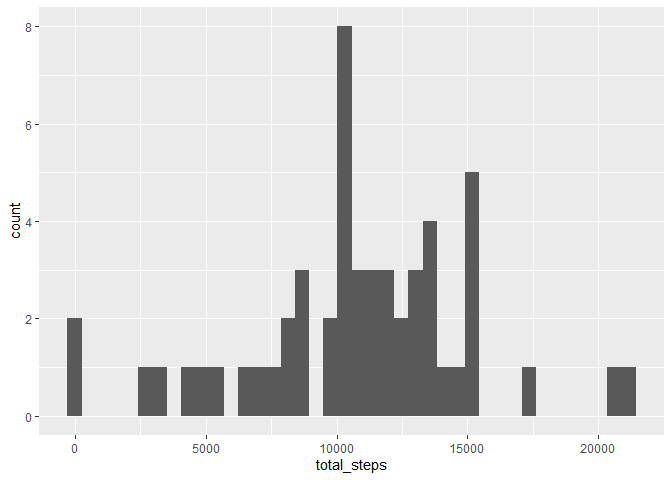
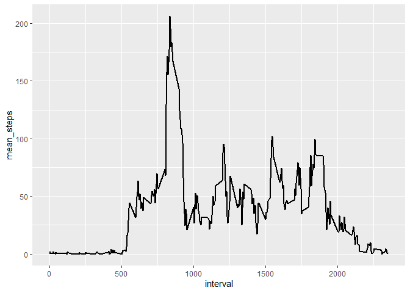
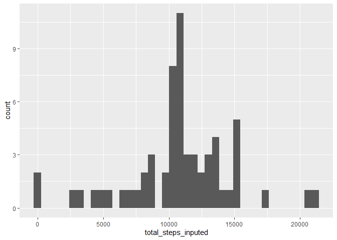
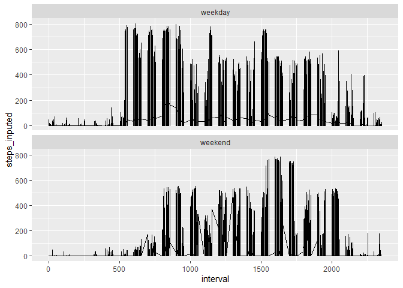
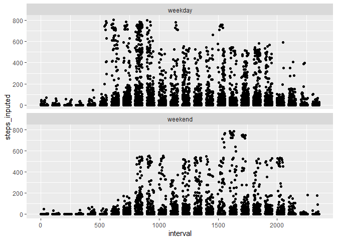

## Loading and preprocessing the data


```r
library(tidyverse)
```

```
## -- Attaching packages --------------------------------------- tidyverse 1.3.0 --
```

```
## v ggplot2 3.3.2     v purrr   0.3.4
## v tibble  3.0.4     v dplyr   1.0.2
## v tidyr   1.1.2     v stringr 1.4.0
## v readr   1.4.0     v forcats 0.5.0
```

```
## -- Conflicts ------------------------------------------ tidyverse_conflicts() --
## x dplyr::filter() masks stats::filter()
## x dplyr::lag()    masks stats::lag()
```

```r
library(knitr)
activity_df = read_csv(file = "activity.csv")
```

```
## 
## -- Column specification --------------------------------------------------------
## cols(
##   steps = col_double(),
##   date = col_date(format = ""),
##   interval = col_double()
## )
```


## What is mean total number of steps taken per day?
For this part of the assignment, you can ignore the missing values in the dataset.

### Calculate the total number of steps taken per day.


```r
atb = activity_df %>%
    group_by(date) %>%
    summarise(total_steps = sum(steps)) 
```

```
## `summarise()` ungrouping output (override with `.groups` argument)
```

```r
kable(atb, format = "html")
```

<table>
 <thead>
  <tr>
   <th style="text-align:left;"> date </th>
   <th style="text-align:right;"> total_steps </th>
  </tr>
 </thead>
<tbody>
  <tr>
   <td style="text-align:left;"> 2012-10-01 </td>
   <td style="text-align:right;"> NA </td>
  </tr>
  <tr>
   <td style="text-align:left;"> 2012-10-02 </td>
   <td style="text-align:right;"> 126 </td>
  </tr>
  <tr>
   <td style="text-align:left;"> 2012-10-03 </td>
   <td style="text-align:right;"> 11352 </td>
  </tr>
  <tr>
   <td style="text-align:left;"> 2012-10-04 </td>
   <td style="text-align:right;"> 12116 </td>
  </tr>
  <tr>
   <td style="text-align:left;"> 2012-10-05 </td>
   <td style="text-align:right;"> 13294 </td>
  </tr>
  <tr>
   <td style="text-align:left;"> 2012-10-06 </td>
   <td style="text-align:right;"> 15420 </td>
  </tr>
  <tr>
   <td style="text-align:left;"> 2012-10-07 </td>
   <td style="text-align:right;"> 11015 </td>
  </tr>
  <tr>
   <td style="text-align:left;"> 2012-10-08 </td>
   <td style="text-align:right;"> NA </td>
  </tr>
  <tr>
   <td style="text-align:left;"> 2012-10-09 </td>
   <td style="text-align:right;"> 12811 </td>
  </tr>
  <tr>
   <td style="text-align:left;"> 2012-10-10 </td>
   <td style="text-align:right;"> 9900 </td>
  </tr>
  <tr>
   <td style="text-align:left;"> 2012-10-11 </td>
   <td style="text-align:right;"> 10304 </td>
  </tr>
  <tr>
   <td style="text-align:left;"> 2012-10-12 </td>
   <td style="text-align:right;"> 17382 </td>
  </tr>
  <tr>
   <td style="text-align:left;"> 2012-10-13 </td>
   <td style="text-align:right;"> 12426 </td>
  </tr>
  <tr>
   <td style="text-align:left;"> 2012-10-14 </td>
   <td style="text-align:right;"> 15098 </td>
  </tr>
  <tr>
   <td style="text-align:left;"> 2012-10-15 </td>
   <td style="text-align:right;"> 10139 </td>
  </tr>
  <tr>
   <td style="text-align:left;"> 2012-10-16 </td>
   <td style="text-align:right;"> 15084 </td>
  </tr>
  <tr>
   <td style="text-align:left;"> 2012-10-17 </td>
   <td style="text-align:right;"> 13452 </td>
  </tr>
  <tr>
   <td style="text-align:left;"> 2012-10-18 </td>
   <td style="text-align:right;"> 10056 </td>
  </tr>
  <tr>
   <td style="text-align:left;"> 2012-10-19 </td>
   <td style="text-align:right;"> 11829 </td>
  </tr>
  <tr>
   <td style="text-align:left;"> 2012-10-20 </td>
   <td style="text-align:right;"> 10395 </td>
  </tr>
  <tr>
   <td style="text-align:left;"> 2012-10-21 </td>
   <td style="text-align:right;"> 8821 </td>
  </tr>
  <tr>
   <td style="text-align:left;"> 2012-10-22 </td>
   <td style="text-align:right;"> 13460 </td>
  </tr>
  <tr>
   <td style="text-align:left;"> 2012-10-23 </td>
   <td style="text-align:right;"> 8918 </td>
  </tr>
  <tr>
   <td style="text-align:left;"> 2012-10-24 </td>
   <td style="text-align:right;"> 8355 </td>
  </tr>
  <tr>
   <td style="text-align:left;"> 2012-10-25 </td>
   <td style="text-align:right;"> 2492 </td>
  </tr>
  <tr>
   <td style="text-align:left;"> 2012-10-26 </td>
   <td style="text-align:right;"> 6778 </td>
  </tr>
  <tr>
   <td style="text-align:left;"> 2012-10-27 </td>
   <td style="text-align:right;"> 10119 </td>
  </tr>
  <tr>
   <td style="text-align:left;"> 2012-10-28 </td>
   <td style="text-align:right;"> 11458 </td>
  </tr>
  <tr>
   <td style="text-align:left;"> 2012-10-29 </td>
   <td style="text-align:right;"> 5018 </td>
  </tr>
  <tr>
   <td style="text-align:left;"> 2012-10-30 </td>
   <td style="text-align:right;"> 9819 </td>
  </tr>
  <tr>
   <td style="text-align:left;"> 2012-10-31 </td>
   <td style="text-align:right;"> 15414 </td>
  </tr>
  <tr>
   <td style="text-align:left;"> 2012-11-01 </td>
   <td style="text-align:right;"> NA </td>
  </tr>
  <tr>
   <td style="text-align:left;"> 2012-11-02 </td>
   <td style="text-align:right;"> 10600 </td>
  </tr>
  <tr>
   <td style="text-align:left;"> 2012-11-03 </td>
   <td style="text-align:right;"> 10571 </td>
  </tr>
  <tr>
   <td style="text-align:left;"> 2012-11-04 </td>
   <td style="text-align:right;"> NA </td>
  </tr>
  <tr>
   <td style="text-align:left;"> 2012-11-05 </td>
   <td style="text-align:right;"> 10439 </td>
  </tr>
  <tr>
   <td style="text-align:left;"> 2012-11-06 </td>
   <td style="text-align:right;"> 8334 </td>
  </tr>
  <tr>
   <td style="text-align:left;"> 2012-11-07 </td>
   <td style="text-align:right;"> 12883 </td>
  </tr>
  <tr>
   <td style="text-align:left;"> 2012-11-08 </td>
   <td style="text-align:right;"> 3219 </td>
  </tr>
  <tr>
   <td style="text-align:left;"> 2012-11-09 </td>
   <td style="text-align:right;"> NA </td>
  </tr>
  <tr>
   <td style="text-align:left;"> 2012-11-10 </td>
   <td style="text-align:right;"> NA </td>
  </tr>
  <tr>
   <td style="text-align:left;"> 2012-11-11 </td>
   <td style="text-align:right;"> 12608 </td>
  </tr>
  <tr>
   <td style="text-align:left;"> 2012-11-12 </td>
   <td style="text-align:right;"> 10765 </td>
  </tr>
  <tr>
   <td style="text-align:left;"> 2012-11-13 </td>
   <td style="text-align:right;"> 7336 </td>
  </tr>
  <tr>
   <td style="text-align:left;"> 2012-11-14 </td>
   <td style="text-align:right;"> NA </td>
  </tr>
  <tr>
   <td style="text-align:left;"> 2012-11-15 </td>
   <td style="text-align:right;"> 41 </td>
  </tr>
  <tr>
   <td style="text-align:left;"> 2012-11-16 </td>
   <td style="text-align:right;"> 5441 </td>
  </tr>
  <tr>
   <td style="text-align:left;"> 2012-11-17 </td>
   <td style="text-align:right;"> 14339 </td>
  </tr>
  <tr>
   <td style="text-align:left;"> 2012-11-18 </td>
   <td style="text-align:right;"> 15110 </td>
  </tr>
  <tr>
   <td style="text-align:left;"> 2012-11-19 </td>
   <td style="text-align:right;"> 8841 </td>
  </tr>
  <tr>
   <td style="text-align:left;"> 2012-11-20 </td>
   <td style="text-align:right;"> 4472 </td>
  </tr>
  <tr>
   <td style="text-align:left;"> 2012-11-21 </td>
   <td style="text-align:right;"> 12787 </td>
  </tr>
  <tr>
   <td style="text-align:left;"> 2012-11-22 </td>
   <td style="text-align:right;"> 20427 </td>
  </tr>
  <tr>
   <td style="text-align:left;"> 2012-11-23 </td>
   <td style="text-align:right;"> 21194 </td>
  </tr>
  <tr>
   <td style="text-align:left;"> 2012-11-24 </td>
   <td style="text-align:right;"> 14478 </td>
  </tr>
  <tr>
   <td style="text-align:left;"> 2012-11-25 </td>
   <td style="text-align:right;"> 11834 </td>
  </tr>
  <tr>
   <td style="text-align:left;"> 2012-11-26 </td>
   <td style="text-align:right;"> 11162 </td>
  </tr>
  <tr>
   <td style="text-align:left;"> 2012-11-27 </td>
   <td style="text-align:right;"> 13646 </td>
  </tr>
  <tr>
   <td style="text-align:left;"> 2012-11-28 </td>
   <td style="text-align:right;"> 10183 </td>
  </tr>
  <tr>
   <td style="text-align:left;"> 2012-11-29 </td>
   <td style="text-align:right;"> 7047 </td>
  </tr>
  <tr>
   <td style="text-align:left;"> 2012-11-30 </td>
   <td style="text-align:right;"> NA </td>
  </tr>
</tbody>
</table>

###  Make a histogram of the total number of steps taken each day

```r
activity_df %>%
    group_by(date) %>%
    summarise(total_steps = sum(steps)) %>%
    ggplot() +
    geom_histogram(mapping = aes(x=total_steps), bins = 40)
```

```
## `summarise()` ungrouping output (override with `.groups` argument)
```

```
## Warning: Removed 8 rows containing non-finite values (stat_bin).
```

<!-- -->

###  Calculate and report the mean and median of the total number of steps taken per day


```r
activity_df %>%
    group_by(date) %>%
    summarise(total_steps = sum(steps)) %>%
    drop_na() %>%
    summarise(mean = mean(total_steps), median = median(total_steps))
```

```
## `summarise()` ungrouping output (override with `.groups` argument)
```

```
## # A tibble: 1 x 2
##     mean median
##    <dbl>  <dbl>
## 1 10766.  10765
```


## What is the average daily activity pattern?

###  Make a time series plot of the 5-minute interval (x-axis) and the average number of steps taken, averaged across all days (y-axis)

```r
activity_df %>%
    drop_na() %>%
    group_by(interval) %>%
    summarise(mean_steps = mean(steps)) %>%
    ggplot() +
    geom_line(mapping = aes(x=interval, y=mean_steps), size=1)
```

```
## `summarise()` ungrouping output (override with `.groups` argument)
```

<!-- -->

###  Which 5-minute interval, on average across all the days in the dataset, contains the maximum number of steps?

```r
activity_df %>%
    drop_na() %>%
    group_by(interval) %>%
    summarise(mean_steps = mean(steps)) %>%
    filter(mean_steps == max(mean_steps))
```

```
## `summarise()` ungrouping output (override with `.groups` argument)
```

```
## # A tibble: 1 x 2
##   interval mean_steps
##      <dbl>      <dbl>
## 1      835       206.
```

###  Which 5-minute interval, on average across all the days in the dataset, contains the maximum number of steps? (alternative solution)

```r
activity_df %>%
    drop_na() %>%
    group_by(interval) %>%
    summarise(mean_steps = mean(steps)) %>%
    slice_max(mean_steps) 
```

```
## `summarise()` ungrouping output (override with `.groups` argument)
```

```
## # A tibble: 1 x 2
##   interval mean_steps
##      <dbl>      <dbl>
## 1      835       206.
```


## Imputing missing values

Note that there are a number of days/intervals where there are missing values (coded as NA). The presence of missing days may introduce bias into some calculations or summaries of the data.

### Calculate and report the total number of missing values in the dataset (i.e. the total number of rows with NA)

```r
activity_df %>%
    filter(is.na(steps)) %>%
    summarise(missing_values = n())
```

```
## # A tibble: 1 x 1
##   missing_values
##            <int>
## 1           2304
```


### Devise a strategy for filling in all of the missing values in the dataset. The strategy does not need to be sophisticated. For example, you could use the mean/median for that day, or the mean for that 5-minute interval, etc.
    
### Create a new dataset that is equal to the original dataset but with the missing data filled in.
 

```r
activity_df_inputed = activity_df %>%
    group_by(interval) %>%
    mutate(steps_inputed = replace(steps, is.na(steps), mean(steps, na.rm=TRUE)))
head(activity_df_inputed)
```

```
## # A tibble: 6 x 4
## # Groups:   interval [6]
##   steps date       interval steps_inputed
##   <dbl> <date>        <dbl>         <dbl>
## 1    NA 2012-10-01        0        1.72  
## 2    NA 2012-10-01        5        0.340 
## 3    NA 2012-10-01       10        0.132 
## 4    NA 2012-10-01       15        0.151 
## 5    NA 2012-10-01       20        0.0755
## 6    NA 2012-10-01       25        2.09
```

### Make a histogram of the total number of steps taken each day and calculate and report the mean and median total number of steps taken per day. Do these values differ from the estimates from the first part of the assignment? What is the impact of imputing missing data on the estimates of the total daily number of steps?


```r
activity_df_inputed %>%
    group_by(date) %>%
    summarise(total_steps_inputed = sum(steps_inputed)) %>%
    ggplot() +
    geom_histogram(mapping = aes(x=total_steps_inputed), bins = 40)
```

```
## `summarise()` ungrouping output (override with `.groups` argument)
```

<!-- -->

## Are there differences in activity patterns between weekdays and weekends?
For this part the weekdays() function may be of some help here. Use the dataset with the filled-in missing values for this part.

### Create a new factor variable in the dataset with two levels – “weekday” and “weekend” indicating whether a given date is a weekday or weekend day.


```r
activity_df_inputed %>%
    mutate(week_day = weekdays(date)) %>%
    mutate(week_day_category = if_else(week_day %in% c("Saturday","Sunday"), "weekend", "weekday")) %>%
    mutate(week_day_category = as_factor(week_day_category))
```

```
## # A tibble: 17,568 x 6
## # Groups:   interval [288]
##    steps date       interval steps_inputed week_day week_day_category
##    <dbl> <date>        <dbl>         <dbl> <chr>    <fct>            
##  1    NA 2012-10-01        0        1.72   Monday   weekday          
##  2    NA 2012-10-01        5        0.340  Monday   weekday          
##  3    NA 2012-10-01       10        0.132  Monday   weekday          
##  4    NA 2012-10-01       15        0.151  Monday   weekday          
##  5    NA 2012-10-01       20        0.0755 Monday   weekday          
##  6    NA 2012-10-01       25        2.09   Monday   weekday          
##  7    NA 2012-10-01       30        0.528  Monday   weekday          
##  8    NA 2012-10-01       35        0.868  Monday   weekday          
##  9    NA 2012-10-01       40        0      Monday   weekday          
## 10    NA 2012-10-01       45        1.47   Monday   weekday          
## # ... with 17,558 more rows
```

### Make a panel plot containing a time series plot (i.e. type = "l") of the 5-minute interval (x-axis) and the average number of steps taken, averaged across all weekday days or weekend days (y-axis). See the README file in the GitHub repository to see an example of what this plot should look like using simulated data.

Using lines to create the time series plot

```r
activity_df_inputed %>%
    mutate(week_day = weekdays(date)) %>%
    mutate(week_day_category = if_else(week_day %in% c("Saturday","Sunday"), "weekend", "weekday")) %>%
    mutate(week_day_category = as_factor(week_day_category)) %>%
    ggplot() +
    geom_line(mapping=aes(x=interval, y=steps_inputed)) +
    facet_wrap(vars(week_day_category), nrow=2)
```

<!-- -->


Using dots to create the time series plot


```r
activity_df_inputed %>%
    mutate(week_day = weekdays(date)) %>%
    mutate(week_day_category = if_else(week_day %in% c("Saturday","Sunday"), "weekend", "weekday")) %>%
    mutate(week_day_category = as_factor(week_day_category)) %>%
    ggplot(mapping=aes(x=interval,y=steps_inputed)) +
    geom_jitter() +
    facet_wrap(vars(week_day_category), nrow=2)
```

<!-- -->

